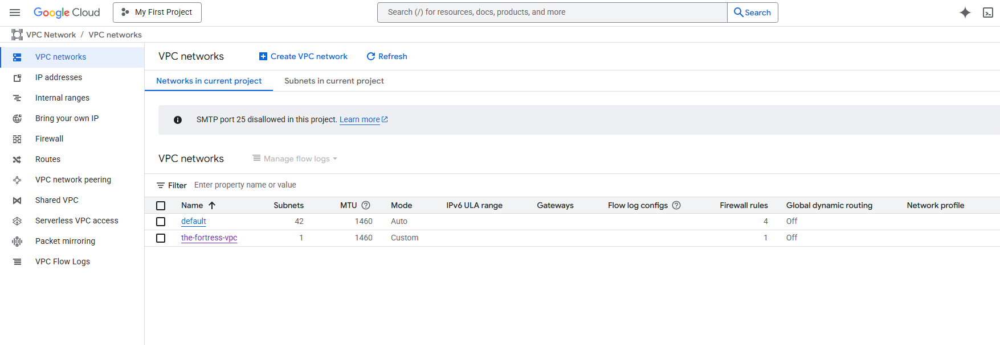

# Project 02: The Fortress - A Secure Custom VPC

## Objective

The goal of this project was to build a foundational, secure network environment in Google Cloud from scratch using Terraform. This moves beyond the default VPC to demonstrate best practices for security and isolation by manually defining all network components. This is a critical skill, as production environments should never rely on default network settings.

---

## Proof of Success

The following screenshot shows the custom VPC, `the-fortress-vpc`, successfully created and visible in the GCP console.

Additionally, the screenshot below confirms the creation of the high-priority `deny-all-ingress` firewall rule, which establishes the secure-by-default posture for the network.

---

## Technologies Used

*   **Terraform:** To define and manage the network resources as code, ensuring a repeatable and version-controlled infrastructure.
*   **Google Cloud Platform (GCP):**
    *   **VPC Network (`google_compute_network`):** To create the isolated network container.
    *   **Subnetworks (`google_compute_subnetwork`):** To define the private IP address space for the region.
    *   **Firewall Rules (`google_compute_firewall`):** To enforce a strict, deny-by-default security policy.

---

## Key Learnings & Design Choices

This project was a significant step in understanding cloud networking and security principles:

*   **Custom VPC Creation:** I learned the importance of setting `auto_create_subnetworks = false` to gain full control over the network environment. This prevents Google from creating default subnets and overly-permissive firewall rules, which is a major security risk.

*   **Resource Dependencies:** I implemented dependencies in Terraform, where the subnet and firewall rule explicitly reference the ID of the VPC (`google_compute_network.the_fortress_vpc.id`). This ensures resources are created in the correct order and are logically bound together.

*   **Security by Default (Zero Trust):** By creating a high-priority `deny_all_ingress` rule, I established a "zero trust" network foundation. This means that no traffic is allowed into the network unless it is explicitly permitted by another, more specific firewall rule. This is a core principle for protecting cloud resources from unauthorized access.

*   **CIDR Range Planning:** I defined a private IP address space (`10.0.1.0/24`) for the subnet, demonstrating an understanding of basic network address planning.

---

## How to Run

1.  Navigate to this project directory: `cd projects/02-secure-custom-vpc`
2.  Initialize Terraform: `terraform init`
3.  Review the execution plan: `terraform plan`
4.  Apply the configuration: `terraform apply`