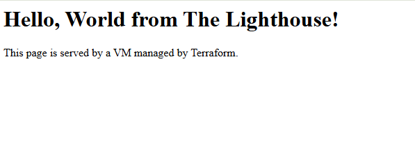

# Project 03: The Lighthouse - A Secure, Auto-Configured Web Server

## Objective

The goal of this project was to build upon the secure network foundation from Project 02 by deploying a functional, public-facing web server. This project demonstrates a complete, automated deployment, including resource provisioning, security configuration, and virtual machine bootstrapping.

---

## Proof of Success

The following screenshot shows the "Hello, World" page being served successfully from the web server's public IP address.

*(Take a screenshot of your browser showing the "Hello, World from The Lighthouse!" page and place it in a `docs` folder within this project, then update the path below.)*

---

## Architecture & Design Choices

This project consists of five core resources managed by Terraform:

1.  **Custom VPC & Subnet:** Provides a secure, isolated network environment, separate from the default network.
2.  **Dedicated Service Account:** A modern security best practice. The VM is given its own unique identity (`web-server-sa`) instead of using broad, default permissions.
3.  **Identity-Based Firewall Rule:** The firewall rule allowing HTTP traffic is tied directly to the VM's Service Account, not a generic network tag. This is a more secure, precise method of granting access. A second rule was added to allow SSH access via Google's secure IAP service for maintenance.
4.  **Compute Engine VM:** An `e2-micro` instance is automatically configured at boot time using a startup script.
5.  **Startup Script (`startup.sh`):** The VM is bootstrapped using a script loaded via the `file()` function for maximum reliability. This script updates the OS, installs the Nginx web server, and deploys a custom `index.html` page.

---

## Key Learnings & Debugging Journey

This project was an extensive, real-world lesson in advanced cloud engineering and troubleshooting.

*   **Modern Security Posture:** I successfully implemented an identity-based security model using a dedicated Service Account and a targeted firewall rule, which is superior to using network tags.
*   **Robust Scripting:** I learned that using the `file()` function to load startup scripts is more robust and avoids cross-platform formatting errors (`exec: format error`) that can occur with inline scripts.
*   **Advanced Debugging:** This project required a deep dive into troubleshooting a complex, multi-layered system. I successfully diagnosed and resolved:
    *   A **Terraform Provider Bug** related to the `tags` attribute by refactoring the code to use a Service Account instead.
    *   A **Google Cloud IAM `403 Forbidden` Error** by identifying and disabling restrictive, inherited Organization Policies.
    *   A **VM Connectivity Issue** by adding a specific firewall rule to allow SSH via Google's Identity-Aware Proxy.

This project demonstrates not only the ability to build cloud infrastructure, but the critical engineering skill of debugging and solving complex problems across the entire technology stack.

---

## How to Run

1.  Navigate to this project directory: `cd projects/03-web-server-in-vpc`
2.  Initialize Terraform: `terraform init`
3.  Review the execution plan: `terraform plan`
4.  Apply the configuration: `terraform apply`