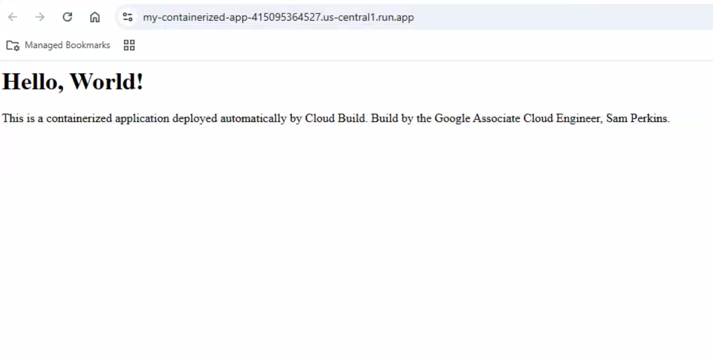
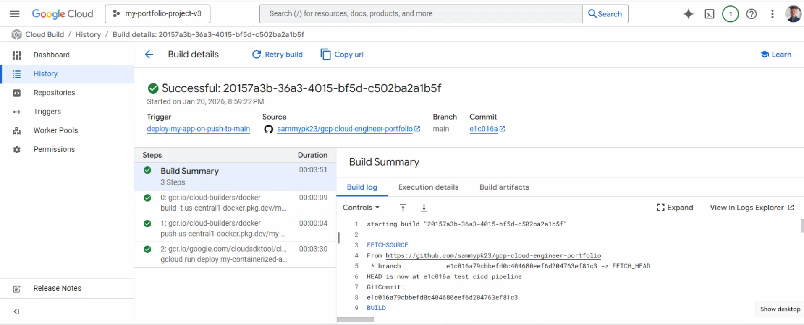

# Project 06: The Enterprise-Grade CI/CD Pipeline

## Objective

The goal of this project was to architect and deploy a fully automated, production-ready CI/CD pipeline on Google Cloud. This project represents a significant evolution from static infrastructure deployment by embracing a **complete "source-to-prod" automation workflow, mirroring a real-world enterprise DevOps environment.** The system is designed to automatically build and deploy a containerized web application from a single `git push`, managed entirely through Infrastructure as Code.

---

## Proof of Success

The following screenshot shows the live web application being served by Cloud Run after a successful, fully automated deployment triggered by a `git push`.

The Cloud Build history shows a complete, successful pipeline run. Each stage—building the container, pushing it to Artifact Registry, and deploying to Cloud Run—is marked with a green check, providing a clear audit trail of the automated process.

---

## Architecture & Design Choices

This project was built using a professional, modular Terraform structure to create a secure and automated deployment system.

*   **Application-Focused Terraform Modules:** As a deliberate step towards enterprise-grade IaC, this architecture introduces higher-level modules like `cloud-run-service` and `cloud-build-cicd`. This abstraction allows application teams to deploy services without needing to know the underlying implementation details, demonstrating a key platform engineering practice.
*   **Automated CI/CD Pipeline:** A Cloud Build trigger is configured to automatically start the pipeline upon a `git push` to the `main` branch. This "hands-off" approach eliminates manual deployment steps, increases velocity, and reduces the risk of human error.
*   **Security & The Principle of Least Privilege:** A **dedicated, custom service account** is created specifically for the CI/CD pipeline. It is granted only the exact IAM roles it needs to perform its job (`cloudbuild.builds.builder`, `artifactregistry.writer`, `run.developer`, `logging.logWriter`), strictly adhering to this core security principle.
*   **Containerization & Serverless:** The application is containerized with Docker for runtime consistency and deployed to **Cloud Run**, a fully managed serverless platform. This provides automatic scaling (including to zero), eliminates server management, and reduces operational overhead.

---

## Key Learnings & Epic Debugging Journey

This project was a masterclass in real-world troubleshooting, spanning the full stack from cloud infrastructure permissions to application-level code dependencies.

*   **Mastering Complex IAM Dependencies:** The most significant challenge was navigating the intricate web of permissions for the custom service account. The initial build failures were not a single issue but a cascade of `Permission Denied` errors. I systematically diagnosed and resolved each one by adding the necessary roles, learning that a service account needs permission not only to *use* services (like Cloud Run) but also to *perform the build itself* (`cloudbuild.builds.builder`) and write its own logs (`logging.logWriter`).

*   **Isolating Infrastructure vs. Application Errors:** A critical lesson was learning to distinguish between a problem with the "factory" (the CI/CD infrastructure) and a problem with the "blueprint" (the application code). After solving all infrastructure issues, the pipeline still failed. By analyzing the build logs, I discovered the root causes were within the application code itself: an `unknown instruction` error in the `Dockerfile` and a Python `ImportError` due to an incompatible dependency.

*   **Deepening Terraform Expertise:** I encountered and fixed several subtle Terraform configuration errors, such as placing the `service_account` argument in the correct block of the `google_cloudbuild_trigger` resource and changing the trigger's `location` from `"global"` to a specific region to comply with modern GCP API requirements. This reinforced the importance of precise syntax and understanding provider-specific rules.

This journey demonstrates not only the ability to architect a complex, automated system but also the critical engineering skill of debugging and solving problems across multiple layers of the technology stack.

---

## How to Run

1.  Navigate to this project directory: `cd projects/06-automated-container-deployment`
2.  Create a `terraform.tfvars` file with your `project_id`, `github_owner`, `connection_name`, etc.
3.  Initialize Terraform: `terraform init`
4.  Apply the configuration to build the CI/CD infrastructure: `terraform apply`
5.  **Trigger the pipeline:** Make a code change inside the `apps/` directory and push it to the `main` branch on GitHub. The pipeline will run automatically.